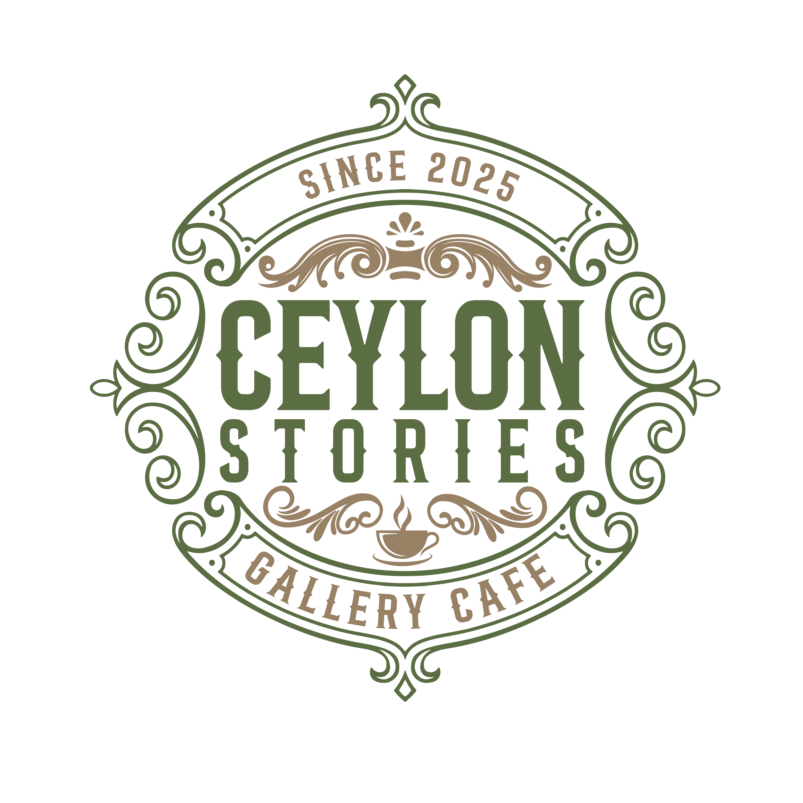
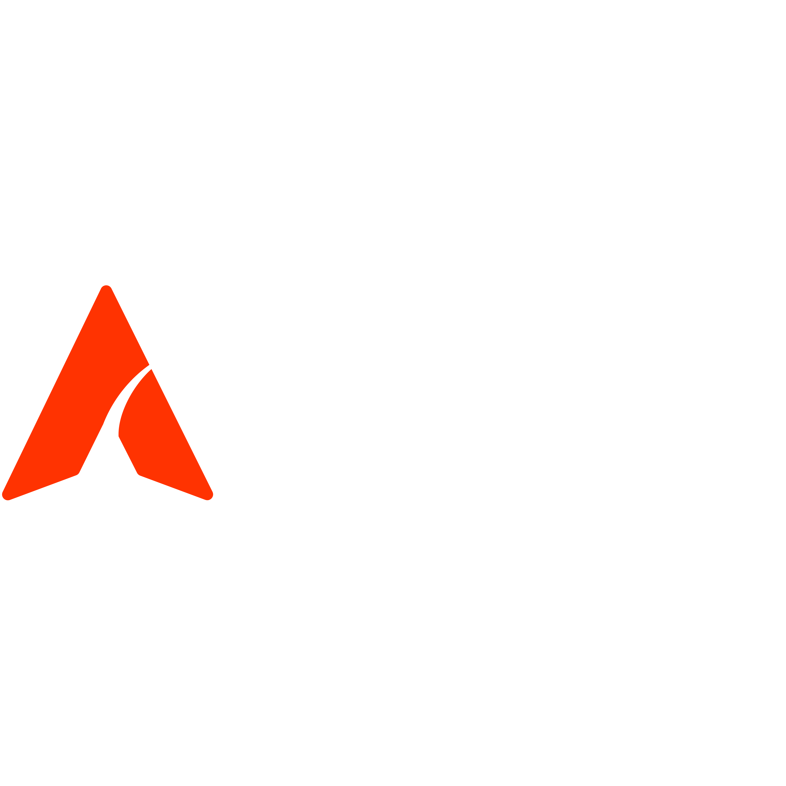

  
    
  
Built by

  

---

# Ceylon Stories — Gallery Cafe

Premium heritage website for **Ceylon Stories — Gallery Cafe**, Kolpetty, Colombo. A complimentary pro bono build by [Ardeno Studio](https://ardeno-studio-website.vercel.app).

**Ref:** ARD-CEYLON-0410 · **Date:** April 2026

---

## Stack

| Layer | Technology |
|---|---|
| Framework | Next.js (React) |
| Styling | Tailwind CSS |
| Animations | Framer Motion + GSAP |
| Backend | Supabase (PostgreSQL) |
| Hosting | Vercel |

## Pages

1. **Home** — Cinematic hero, brand story, featured artist, tea & food highlights, Instagram feed
2. **Our Story** — Founders, vision, the Ceylon Stories philosophy
3. **Menu** — Food, beverages, Dilmah tea experience, shisha lounge
4. **The Gallery** — Monthly rotating artist feature with CMS
5. **Experience** — Tea tastings, shisha lounge, events
6. **Stories / Blog** — Editorial blog with CMS
7. **Visit Us** — Location, hours, Google Maps, WhatsApp reservations
8. **Contact** — Inquiry form, social links, Dilmah partnership

## Design

Heritage visual theme — terracotta, aged cream, mahogany, forest green. Batik-inspired textures, botanical motifs, editorial typography. Built to feel like Ceylon.

---

  © 2026 Ardeno Studio · ardenostudio@gmail.com · Colombo, Sri Lanka

